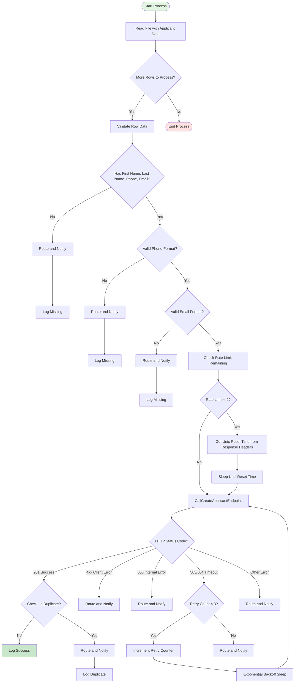

This workflow diagram illlustrates the end-to-end process for creating applicants via API from file-based data from an ATS system. It is designed with the core principles of data quality, validation and rate limit management with comprehensive error handling. 

**Data Validation**
Before any API call, the data from the row (or the system via API response) should undergo validation to ensure all required fields are present and that phone numbers and emails are formatted properly. Invalid data should be flagged and reviewed so as not to consume API rate limits on data will fail anyway

**Rate Limiting**
This workflow will actively monitor rate limits by checking the remaining request response header before calls. When it drops to a certain threshold, read the reset UNIX timestamp and sleep until ready to resume API calls. It ensures no rate limit violations and uninterrupted processing.

**Error Handling**
4xx Client errors
500 internal errors
503/504 retries
Duplicate handling

